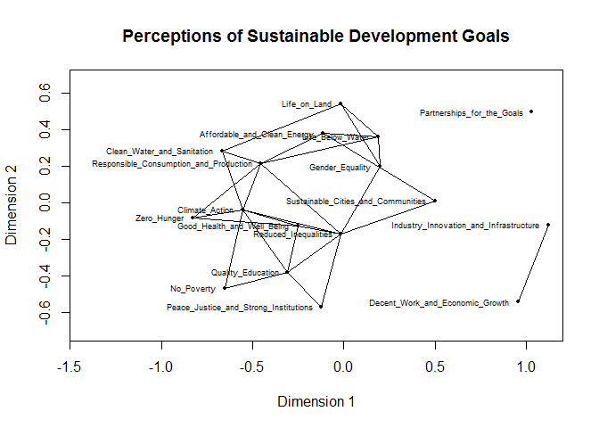

<!-- README.md is generated from README.Rmd. Please edit that file -->
thectar
=======

<!-- badges: start -->
<!-- badges: end -->
thectar provides tools to facilitate the second step of Hermeneutic Content Analysis (Bergman, 2010, <https://dx.doi.org/10.4135/9781506335193>). The current version focuses on the use of Multidimensional Scaling (MDS). It provides tools for data preparation, modeling, and interpretation of MDS maps. Many of the tools depend on the package 'smacof' (Mair, De Leuuw, Borg, & Groenen, <https://CRAN.R-project.org/package=smacof>).

Example
-------

This basic example shows how to compute a similarity matrix and create a plot showing the 20% highest similarities. For this, we use example data on the 17 Sustainable Development Goals. The final map shows similarity of SDGs in terms of importance according to the respondents.

``` r
library(thectar)
# Calculate a similiarity matrix using Association Strength Index
data(SDG_coocurrence)
SDG_coocurrence <- SDG_coocurrence[,-2] # Drop the second column as it is not relevant
similarity <- simi(SDG_coocurrence, method = "as", comments = FALSE)
similarity[1:3, 1:3] # Show first three rows and columns
#>                            No_Poverty Zero_Hunger
#> No_Poverty                 0.05882353  0.03715170
#> Zero_Hunger                0.03715170  0.05263158
#> Good_Health_and_Well_Being 0.02941176  0.04135338
#>                            Good_Health_and_Well_Being
#> No_Poverty                                 0.02941176
#> Zero_Hunger                                0.04135338
#> Good_Health_and_Well_Being                 0.07142857

# Create a plot showing the 20% highest similarities
# To compute the MDS solution, we use the package 'smacof' (Mair, De Leuuw, 
# Borg, & Groenen). 

dissimilarity <- max(similarity) - similarity
res <- smacof::smacofSym(dissimilarity, type = "ordinal")
highlall(similarity, res, quantile = 20, xlim = c(-1.4,1.1), cex.labels = 0.55, 
         main = "Perceptions of Sustainable Development Goals")
```


